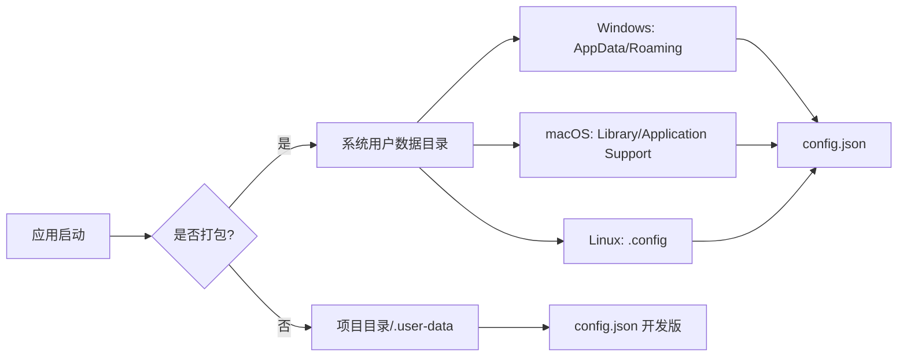
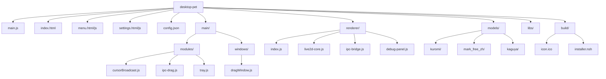

# 向日葵桌面宠物

一个基于 Electron 开发的简约桌面宠物应用。

## 功能特点

- 🎨 透明窗口，只显示模型
- 🖱️ 可拖拽移动窗口
- 👆 点击模型触发动画
- 👀 鼠标跟随（眼珠跟随鼠标移动）
- 🔝 始终置顶显示
- 📌 系统托盘支持（双击显示/隐藏窗口）
- 🎭 支持 Cubism 3.0 格式模型
- 🎛️ 右键菜单支持切换模型、调整窗口大小、触发动作等
- 🔒 锁定功能（窗口完全穿透，无法交互）
- ⚙️ 设置窗口（配置默认模型、窗口大小等）

## 快速开始

### 安装依赖

```bash
npm install
```

或使用 pnpm：

```bash
pnpm install
```

### 运行

```bash
npm start
```

## 打包安装程序

### 前置要求

1. 安装 Node.js (>=16.0.0)
2. 安装依赖：`npm install`
3. 准备应用图标：在 `build/` 目录下放置 `icon.ico`（Windows）

### 打包命令

```bash
# 打包 Windows 安装程序
npm run build:win

# 打包所有平台（当前配置仅 Windows）
npm run build

# 仅生成打包目录（不生成安装程序）
npm run build:dir
```

### 打包配置

打包配置位于 `package.json` 的 `build` 字段：

- **输出目录**：`dist/`
- **应用 ID**：`com.sunflower.desktop-pet`
- **产品名称**：`向日葵桌面宠物`
- **安装程序类型**：NSIS（Windows）
- **架构**：x64

### 数据目录



**打包后的数据目录位置：**

- **Windows**: `C:\Users\<用户名>\AppData\Roaming\向日葵桌面宠物\`
- **macOS**: `~/Library/Application Support/向日葵桌面宠物/`
- **Linux**: `~/.config/向日葵桌面宠物/`

**开发环境数据目录：**

- `项目目录/.user-data/`

### 安装程序选项

- ✅ 允许用户选择安装目录
- ✅ 创建桌面快捷方式
- ✅ 创建开始菜单快捷方式
- ✅ 卸载时保留用户数据（可选删除）

## 项目结构



## 使用说明

1. **启动应用**：运行 `npm start` 或双击安装程序
2. **点击交互**：点击模型触发动画
3. **鼠标跟随**：鼠标移动时，模型的眼睛会跟随鼠标移动
4. **拖拽窗口**：在模型外的区域点击并拖拽可以移动窗口
5. **右键菜单**：右键点击模型打开菜单
   - 切换窗口置顶状态
   - 锁定/解锁窗口
   - 调整窗口大小（小/中/大，使用预设）
   - 切换模型（Kuromi / Mark / Kaguya）
   - 触发动作互动
   - 打开**模型窗口调试面板**（实时调节舞台宽高/缩放/偏移）
   - 打开设置窗口
   - 显示/隐藏窗口
   - 退出应用
6. **系统托盘**：单击/双击托盘图标切换显示/隐藏窗口，并可从托盘菜单锁定/解锁窗口
7. **设置窗口**：配置默认模型、窗口大小、调试选项、是否显示在任务栏等

## 技术栈

- **Electron** - 跨平台桌面应用框架
- **PIXI.js** - WebGL 渲染引擎
- **pixi-live2d-display** - 模型显示库
- **Cubism Core** - 核心 SDK
- **electron-builder** - 应用打包工具

## 配置说明

### 应用配置（config.json）

```json
{
  "defaultModel": "kuromi",
  "defaultStageSize": "small",
  "isLocked": false,
  "isAlwaysOnTop": true,
  "skipTaskbar": true,
  "debugMode": false,
  "autoOpenDevTools": false
}
```

### 窗口大小预设（stage-size-presets.json）

存储每个模型的推荐窗口大小配置，可通过右键菜单或设置窗口调整。

## 故障排除

### 模型加载失败

1. 检查模型文件是否存在
2. 确保所有模型相关文件（.moc3, .model3.json, .physics3.json, textures/）完整
3. 检查 `stage-size-presets.json` 配置

### 窗口无法显示

1. 检查是否有其他窗口遮挡
2. 尝试右键托盘图标选择"显示窗口"
3. 检查控制台错误信息

### 打包问题

1. 确保已安装所有依赖：`npm install`
2. 检查 `build/icon.ico` 是否存在
3. 查看 `dist/` 目录下的日志文件

## 开发说明

### 调试模式

在设置窗口中启用“调试模式”和“自动打开开发者工具”，或直接编辑 `config.json`：

```json
{
  "debugMode": true,
  "autoOpenDevTools": true
}
```

-### 数据目录
-
-**开发环境**：`项目目录/.user-data/`
-**打包后**：系统用户数据目录（见上方数据目录说明）
+### 数据目录（汇总）
+
+同上方“数据目录”一节：
+
+- **开发环境**：`项目目录/.user-data/`
+- **打包后**：系统用户数据目录（见上方“数据目录”说明）
+
+### 开发者快速索引
+
+- **主进程入口**：`main.js`（窗口创建、配置加载、托盘、菜单、锁定逻辑）
+- **渲染进程核心**：`renderer/live2d-core.js`（PIXI 初始化与模型行为）
+- **拖拽与交互蒙层**：`overlay.html` / `overlay.js`
+- **右键菜单窗口**：`menu.html` / `menu.js`
+- **设置窗口**：`settings.html` / `settings.js`
+- **托盘模块**：`main/modules/tray.js`
